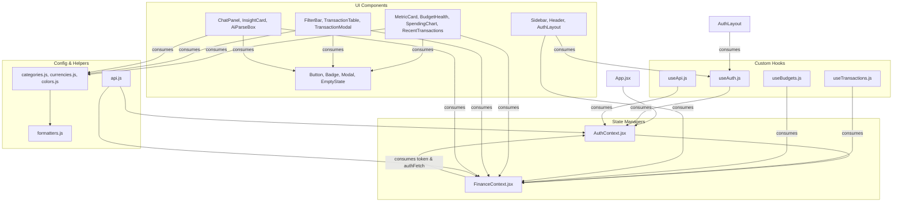

# Floony AI - System Architecture & Auth Flow Reference Document

This document provides a clear, high-level structural map of the Floony AI codebase. It explains which file handles which functionality, step-by-step authentication procedures, and how each feature is implemented across the backend and frontend.

---

## 1. Project Directory & File Responsibilities

### Backend Files (`/backend`)

* **[server.js](file:///home/bishalsingh/Floony%20AI/backend/server.js)**
  * **Main Role**: Express application server and REST API gateway.
  * **What it does**:
    * Initializes environment configuration and connects to the PostgreSQL database.
    * Defines public API endpoints for User Registration (`/api/auth/register`) and User Login (`/api/auth/login`).
    * Defines protected API endpoints for user profile (`/api/auth/me`), transactions (`GET`, `POST`, `PUT`, `DELETE` `/api/transactions`), budget limits (`GET`, `POST` `/api/budgets`), natural language AI expense parsing (`/api/ai/parse`), and AI financial advice chat (`/api/ai/chat`).
    * Enforces authentication middleware on protected routes to ensure user data isolation.

* **[authService.js](file:///home/bishalsingh/Floony%20AI/backend/authService.js)**
  * **Main Role**: Authentication & Security Utility Module.
  * **What it does**:
    * **Password Hashing**: Uses Node's native `crypto` module (PBKDF2 algorithm with SHA-512, 10,000 iterations, and a 16-byte random salt) to hash user passwords before storing them in the database.
    * **Password Verification**: Re-hashes entered passwords using the saved salt to verify validity against original hashes.
    * **Token Generation**: Generates 30-day JSON Web Tokens (JWT) containing user identity details (`id`, `username`, `email`).
    * **Authentication Middleware (`authenticateToken`)**: Intercepts HTTP requests, checks for a Bearer token in the Authorization header, verifies token validity, and attaches the decoded user payload to `req.user`.

* **[db.js](file:///home/bishalsingh/Floony%20AI/backend/db.js)**
  * **Main Role**: PostgreSQL Database Connection & Schema Verifier.
  * **What it does**:
    * Configures PostgreSQL connection pooling (connecting to Supabase database instance with SSL support).
    * Automatically verifies and creates required SQL database tables if they do not exist:
      1. `users`: Stores user credentials (`id`, `username`, `email`, `password`, `created_at`).
      2. `transactions`: Stores user transactions (`id`, `user_id`, `amount`, `type`, `category`, `merchant`, `date`, `description`, `created_at`). Foreign key links to `users` table with cascading delete.
      3. `budgets`: Stores spending targets (`category`, `user_id`, `amount`, `period`). Composite primary key on `(category, user_id)` with foreign key linking to `users`.

* **[aiService.js](file:///home/bishalsingh/Floony%20AI/backend/aiService.js)**
  * **Main Role**: Artificial Intelligence Service Module.
  * **What it does**:
    * **Gemini AI Integration**: Uses `@google/generative-ai` SDK (`gemini-1.5-flash` model) to perform natural language parsing of expense entries and act as an interactive financial advisor.
    * **Smart Fallback Engine**: Contains built-in keyword/regex natural language parser and financial advice generation logic when an API key is missing or unavailable.

* **[.env](file:///home/bishalsingh/Floony%20AI/backend/.env)**
  * **Main Role**: Environment configuration variables (`DATABASE_URL`, `JWT_SECRET`, `GEMINI_API_KEY`, `PORT`).

---

### Frontend Files (`/frontend/src`)

* **[main.jsx](file:///home/bishalsingh/Floony%20AI/frontend/src/main.jsx)**
  * **Main Role**: React Application Entry Point.
  * **What it does**: Renders the root `<App />` component into the HTML DOM node inside React `StrictMode`.

* **[App.jsx](file:///home/bishalsingh/Floony%20AI/frontend/src/App.jsx)**
  * **Main Role**: Core Single Page Application (SPA) Router Shell.
  * **What it does**:
    * Wraps the application inside `AuthProvider` and `FinanceProvider` context components.
    * Handles top-level tab-switching navigation routing (`dashboard`, `transactions`, `ai-coach`, `budgets`).
    * Controls manual transaction lightbox overlays.

* **[index.css](file:///home/bishalsingh/Floony%20AI/frontend/src/index.css)**
  * **Main Role**: Global Design System & Styling Rules.
  * **What it does**: Defines dark-mode color tokens, typography (Plus Jakarta Sans font), glassmorphism card styling, responsive grid layouts, category badge colors, modal overlays, scrollbars, and button hover animations.

* **[index.html](file:///home/bishalsingh/Floony%20AI/frontend/index.html)** (located in `/frontend`)
  * **Main Role**: Base HTML template file including title, viewport setup, and Google Fonts links.

---

### Modular Code Directories

#### `constants/`
* **[categories.js](file:///home/bishalsingh/Floony%20AI/frontend/src/constants/categories.js)**: Centralized categories definitions and styling class mappings.
* **[currencies.js](file:///home/bishalsingh/Floony%20AI/frontend/src/constants/currencies.js)**: Mapping for currency codes to symbols (INR, USD, EUR, etc.).
* **[colors.js](file:///home/bishalsingh/Floony%20AI/frontend/src/constants/colors.js)**: Category colors for charts.

#### `utils/`
* **[formatters.js](file:///home/bishalsingh/Floony%20AI/frontend/src/utils/formatters.js)**: Currency and short date formatting helpers.

#### `services/`
* **[api.js](file:///home/bishalsingh/Floony%20AI/frontend/src/services/api.js)**: Network helper service object mapping all API client requests.

#### `context/`
* **[AuthContext.jsx](file:///home/bishalsingh/Floony%20AI/frontend/src/context/AuthContext.jsx)**: Handles login, registration, logout requests, token storage, and session checks. Exposes secure `authFetch` wrapper.
* **[FinanceContext.jsx](file:///home/bishalsingh/Floony%20AI/frontend/src/context/FinanceContext.jsx)**: Manages global transactions records, category budgets list, currency switcher states, AI status checks, and Gemini chat advisors.

#### `hooks/`
* **[useAuth.js](file:///home/bishalsingh/Floony%20AI/frontend/src/hooks/useAuth.js)**: Consumes `AuthContext`.
* **[useApi.js](file:///home/bishalsingh/Floony%20AI/frontend/src/hooks/useApi.js)**: Exposes `authFetch` helper.
* **[useTransactions.js](file:///home/bishalsingh/Floony%20AI/frontend/src/hooks/useTransactions.js)**: Exposes CRUD queries and states for transactions.
* **[useBudgets.js](file:///home/bishalsingh/Floony%20AI/frontend/src/hooks/useBudgets.js)**: Exposes budget targets and adjustment handlers.

#### `components/UI/`
* **[Button.jsx](file:///home/bishalsingh/Floony%20AI/frontend/src/components/UI/Button.jsx)**: UI Button with optional loading indicators.
* **[Badge.jsx](file:///home/bishalsingh/Floony%20AI/frontend/src/components/UI/Badge.jsx)**: Category color tags.
* **[EmptyState.jsx](file:///home/bishalsingh/Floony%20AI/frontend/src/components/UI/EmptyState.jsx)**: Layout shown when lists are empty.
* **[Modal.jsx](file:///home/bishalsingh/Floony%20AI/frontend/src/components/UI/Modal.jsx)**: Reusable modal lightbox overlay wrapper.

#### `components/Layout/`
* **[Sidebar.jsx](file:///home/bishalsingh/Floony%20AI/frontend/src/components/Layout/Sidebar.jsx)**: Tab navigator sidebar including profile stats and engine health indicators.
* **[Header.jsx](file:///home/bishalsingh/Floony%20AI/frontend/src/components/Layout/Header.jsx)**: Top header panel displaying page titles, currency selector, and transaction logs buttons.
* **[AuthLayout.jsx](file:///home/bishalsingh/Floony%20AI/frontend/src/components/Layout/AuthLayout.jsx)**: Login and registration forms view.

#### `components/Dashboard/`
* **[MetricCard.jsx](file:///home/bishalsingh/Floony%20AI/frontend/src/components/Dashboard/MetricCard.jsx)**: Balance and inflow/outflow metrics.
* **[BudgetHealth.jsx](file:///home/bishalsingh/Floony%20AI/frontend/src/components/Dashboard/BudgetHealth.jsx)**: Interactive visual meters.
* **[SpendingChart.jsx](file:///home/bishalsingh/Floony%20AI/frontend/src/components/Dashboard/SpendingChart.jsx)**: Area charts showing daily expenditures.
* **[RecentTransactions.jsx](file:///home/bishalsingh/Floony%20AI/frontend/src/components/Dashboard/RecentTransactions.jsx)**: Lists the last 5 transactions.

#### `components/Transactions/`
* **[FilterBar.jsx](file:///home/bishalsingh/Floony%20AI/frontend/src/components/Transactions/FilterBar.jsx)**: Custom inputs for searching and category filters.
* **[TransactionTable.jsx](file:///home/bishalsingh/Floony%20AI/frontend/src/components/Transactions/TransactionTable.jsx)**: Main records display grid.
* **[TransactionModal.jsx](file:///home/bishalsingh/Floony%20AI/frontend/src/components/Transactions/TransactionModal.jsx)**: Form overlay for ledger inputs.

#### `components/AI/`
* **[ChatPanel.jsx](file:///home/bishalsingh/Floony%20AI/frontend/src/components/AI/ChatPanel.jsx)**: Interactive Gemini chat window.
* **[InsightCard.jsx](file:///home/bishalsingh/Floony%20AI/frontend/src/components/AI/InsightCard.jsx)**: Key analytical recommendations.
* **[AiParseBox.jsx](file:///home/bishalsingh/Floony%20AI/frontend/src/components/AI/AiParseBox.jsx)**: Parses natural language phrases instantly.

---

## 1.5 File Inter-Relationships & Import Map

To maintain a clean and scalable codebase, files are structured with clear import-export boundaries. Below is a map of how components, contexts, hooks, utilities, and backend modules depend on one another.

### Frontend Module Inter-Dependencies



### Key Integration Touchpoints

1. **Context-to-Context Binding**: `FinanceContext.jsx` imports `AuthContext` to access the current session token and the `authFetch` handler. If a request returns `401/403` (unauthorized/expired), `authFetch` automatically signs out the user by clearing the session state in `AuthContext`.
2. **Hooks Abstracting State**: UI components do not consume contexts directly. Instead, they consume hooks like `useTransactions` or `useBudgets`, which provide clean interfaces for ledger CRUD methods and budget adjustments.
3. **Shared Constants**: 
   * `categories.js` matches CSS class badges (e.g. `badge-food`) used in transaction lists and dashboards.
   * `currencies.js` provides dynamic labels (₹, $, €) rendered across headers, metric counts, and forms.
   * `colors.js` assigns distinct hex codes used by the Recharts Vertical Bar visualizers.

---

### Backend Module Inter-Dependencies

```mermaid
graph LR
    Server[server.js] --> DB[db.js]
    Server --> Auth[authService.js]
    Server --> AI[aiService.js]
    
    Auth --> JWT[jsonwebtoken]
    Auth --> Crypto[crypto]
    DB --> PG[pg Connection Pool]
    AI --> Gemini[@google/generative-ai]
```

1. **Database Integration**: `server.js` boots by calling `initDb()` from `db.js`. Once initialized, routes query the shared connection pool via `getDb()`.
2. **Authentication Guard**: Protected routes inside `server.js` prepend the `authenticateToken` middleware. This middleware parses incoming JWT signatures and decorates the request with `req.user` details before executing database operations.
3. **AI Reasoning Delegates**: The AI routes (`/api/ai/parse` and `/api/ai/chat`) call asynchronous handlers inside `aiService.js`, which manages the prompt formatting logic and Google GenAI client connections.

---

## 2. Step-by-Step Authentication (Auth) Flow

```
[ User in Frontend ]
│
├── 1. Register / Login Form Submission (AuthLayout.jsx)
▼
[ HTTP POST /api/auth/register OR /api/auth/login ] ─────────► [ server.js ]
│
├── 2. Query User in PostgreSQL DB (db.js)
│
├── 3. Hash / Verify Password (authService.js) (PBKDF2 SHA-512 + Salt)
│
└── 4. Generate JWT Token (authService.js) (Expires in 30 days)
│
[ Frontend Receives User + JWT Token ] ◄──────────────────────────────┘
│
├── 5. Save Token & User in localStorage ('floony_token', 'floony_user')
│
├── 6. Future API Requests use authFetch() helper (AuthContext.jsx)
│      Headers: Authorization: Bearer <token>
▼
[ Backend Protected Endpoint ] ──────► [ authenticateToken Middleware (authService.js) ]
│
├── Verify JWT Signature & Expiry
│
├── Attach Decoded User to req.user
▼
[ Execute Route ] (Scope queries to req.user.id)
```

### Detailed Auth Steps

1. **User Registration Flow**:
   * User submits `username`, `email`, and `password` on the authentication screen in `AuthLayout.jsx`.
   * Frontend sends POST request to `/api/auth/register` in `server.js`.
   * Backend checks if username or email exists in PostgreSQL database via `db.js`.
   * If unique, password is encrypted using `hashPassword()` in `authService.js` (PBKDF2 SHA-512 algorithm with a 16-byte random salt).
   * User record is saved in `users` table; backend issues a 30-day JWT token via `generateToken()`.
   * Frontend stores token and user profile in browser `localStorage`.

2. **User Login Flow**:
   * User submits `username` and `password` on the login screen in `AuthLayout.jsx`.
   * Frontend sends POST request to `/api/auth/login` in `server.js`.
   * Backend searches for username in `users` table.
   * `verifyPassword()` in `authService.js` re-hashes the input password with stored salt and compares it against original hash.
   * On match, JWT token is generated and returned to frontend for local storage.

3. **Protected Request Authorization**:
   * All authenticated data operations (fetching/saving transactions, setting budgets, calling AI endpoints) use the `authFetch()` helper in `AuthContext.jsx`.
   * `authFetch()` automatically injects header: `Authorization: Bearer <token>`.
   * On backend, protected routes pass through `authenticateToken` middleware in `authService.js`.
   * Middleware decodes token and attaches identity to `req.user`.
   * Database queries filter results using `WHERE user_id = req.user.id`, guaranteeing strict user data privacy.

4. **Session Termination (Logout)**:
   * User clicks Logout button in sidebar in `Sidebar.jsx`.
   * `logout()` in `AuthContext.jsx` clears stored tokens from `localStorage`, resets React state variables, and returns UI to unauthenticated Login/Register state.
   * If any API request receives 401/403 status (expired/invalid token), `authFetch()` automatically triggers `logout()`.

---

## 3. How Each Feature is Implemented

### Feature 1: User Profile & Session Persistence
* **Files Involved**: `authService.js`, `server.js`, `AuthContext.jsx`, `Sidebar.jsx`
* **Implementation Details**:
  * Persistent sessions survive page reloads by saving JWT token and user info in browser `localStorage`.
  * User profile details (Username, Email, Avatar Initials) are displayed in sidebar header.
  * Dedicated endpoint `/api/auth/me` verifies current token and returns active user details.

### Feature 2: Data Isolation & Multi-Tenant Relational Schema
* **Files Involved**: `db.js`, `server.js`
* **Implementation Details**:
  * Every transaction and budget row in database contains a mandatory `user_id` foreign key.
  * SQL foreign keys enforce `ON DELETE CASCADE` so deleting a user automatically cleans up their transactions and budgets.
  * SQL endpoints use parameterized queries (`$1`, `$2`) to prevent SQL injection vulnerabilities.

### Feature 3: Natural Language Quick Expense Logging (AI Box)
* **Files Involved**: `aiService.js`, `server.js`, `AiParseBox.jsx`, `TransactionModal.jsx`, `FinanceContext.jsx`
* **Implementation Details**:
  * User enters plain text sentence into the AI input bar on Dashboard in `AiParseBox.jsx`.
  * Request sent to POST `/api/ai/parse`.
  * `parseExpenseWithGemini()` in `aiService.js` passes structured system instructions to Gemini API to extract JSON object containing: `amount`, `type`, `category`, `merchant`, `date`, and `description`.
  * Parsed results open a verification modal window in `AiParseBox.jsx`, allowing user to review values before approving.
  * Upon confirmation, `addTransaction` is called on `FinanceContext.jsx` which saves the record to the backend transactions table and celebration confetti animation triggers.

### Feature 4: Interactive AI Financial Advisor & Wealth Coach
* **Files Involved**: `aiService.js`, `server.js`, `ChatPanel.jsx`, `FinanceContext.jsx`
* **Implementation Details**:
  * Chat console located in `ChatPanel.jsx` under the "AI Advisor" tab allows real-time interactive messaging with AI coach.
  * When user sends a message, backend retrieves recent 15 transactions and current budget statuses of logged-in user.
  * Financial profile context and conversation history are sent to Gemini API via `generateFinancialAdviceWithGemini()`.
  * Markdown response rendered in chat bubbles with formatting for bold text, lists, and dynamic currency symbol conversion.

### Feature 5: Dynamic Budgeting & Threshold Alerting
* **Files Involved**: `server.js`, `FinanceContext.jsx`, `BudgetHealth.jsx`, `App.jsx`
* **Implementation Details**:
  * Users can customize monthly spending targets per category in "Budgets" tab, which is updated via `adjustBudget` (`handleBudgetChange`) in `FinanceContext.jsx`.
  * Database uses SQL `ON CONFLICT (category, user_id) DO UPDATE` to create or update budget limits atomically.
  * Frontend calculates cumulative spending per category in real-time in `BudgetHealth.jsx`.
  * Displays color-coded progress bars (green under 70%, yellow 70-90%, red over 90%) and warning alert banners when category thresholds are exceeded.

### Feature 6: Full Transactions Ledger & Multi-Filter Search
* **Files Involved**: `server.js`, `TransactionTable.jsx`, `FilterBar.jsx`, `TransactionModal.jsx`, `FinanceContext.jsx`
* **Implementation Details**:
  * Displays complete history of financial activities in `TransactionTable.jsx`.
  * Supports real-time client-side text searching (matches merchant name or notes) and filters via `FilterBar.jsx`.
  * Category dropdown filtering and Transaction flow filtering (Income vs Expense).
  * Full CRUD support: Add transaction, Edit transaction modal (`TransactionModal.jsx`), Delete transaction with confirmation dialog.

### Feature 7: Real-Time Analytics & Dashboard Overview
* **Files Involved**: `App.jsx`, `MetricCard.jsx`, `SpendingChart.jsx`, `BudgetHealth.jsx`, `RecentTransactions.jsx`, `FinanceContext.jsx`
* **Implementation Details**:
  * Metric summary cards in `App.jsx` render four instances of `MetricCard.jsx` to compute Net Account Balance, Total Income, Total Expense, and Savings Velocity rate percentage.
  * Daily Expenditure Trend Chart: Recharts `AreaChart` inside `SpendingChart.jsx` displaying line graph of spending over time.
  * Category Spending Breakdown: Recharts `BarChart` inside `App.jsx` (Budgets tab) and meters in `BudgetHealth.jsx` visualizing top expense categories.
  * Currency Switcher: Located in `Header.jsx`. Allows toggling displayed currency between INR (₹), USD ($), EUR (€), GBP (£), and JPY (¥) with local storage memory.
