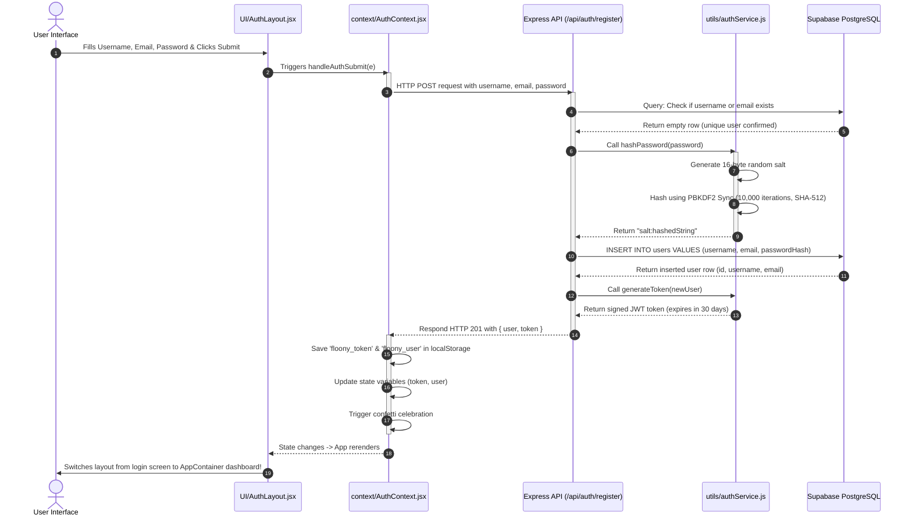
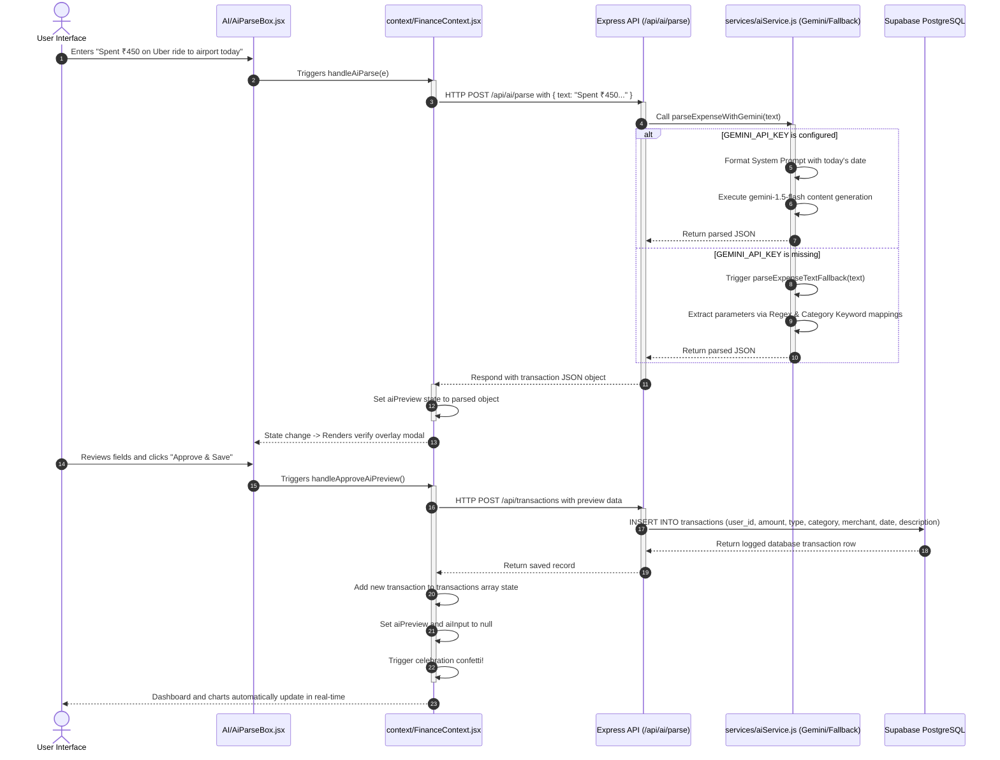
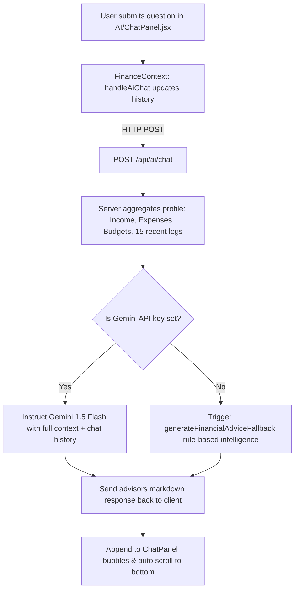
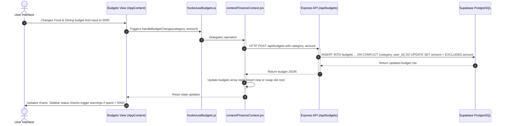

# Floony AI - End-to-End Project Flows & Execution Sequences

This document provides a step-by-step walk-through of the execution paths in Floony AI. It traces actions from the user input on the React client, through the Express APIs and business logic, down to the PostgreSQL database, and back to the user.

---

## Flow 1: User Registration & Authentication Flow

This flow handles user sign-up, secure password hashing, session creation, and subsequent authenticated page rendering.

### Steps in Detail:
1. **Trigger**: The user fills out the form on [AuthLayout.jsx](file:///home/bishalsingh/Floony%20AI/frontend/src/components/Layout/AuthLayout.jsx) and submits.
2. **Context Dispatch**: [AuthContext.jsx](file:///home/bishalsingh/Floony%20AI/frontend/src/context/AuthContext.jsx) receives the submission event, updates loading states, and makes a POST call to the backend server.
3. **Database Check & Encryption**: In the backend, the database is checked for duplicates. If clear, Node's native `crypto` module runs `pbkdf2Sync` to create a secure salt-hash combination.
4. **JWT Generation**: A signed JWT is constructed containing the user's ID, username, and email.
5. **Storage & Rerender**: The frontend saves the token in the browser's `localStorage` for session persistence. React state updates, switching the view router shell from `AuthLayout` to `AppContent`.

---

## Flow 2: Natural Language AI Expense Logging Flow

This is one of the core features of Floony AI, transforming free-form text input into structured database logs.

### Steps in Detail:
1. **Interaction**: The user types a transaction description in [AiParseBox.jsx](file:///home/bishalsingh/Floony%20AI/frontend/src/components/AI/AiParseBox.jsx).
2. **AI Request**: [FinanceContext.jsx](file:///home/bishalsingh/Floony%20AI/frontend/src/context/FinanceContext.jsx) catches the request and sends the query text to `/api/ai/parse`.
3. **Execution Options**:
   - **Gemini Path**: The server builds a prompt instructing Gemini to parse values according to a rigid JSON template.
   - **Fallback Path**: If no API key is found, regular expressions isolate amounts and dates, and lookup lists match keywords to categories (e.g. *sushi* mapped to *Food & Dining*).
4. **User Verification**: A modal overlay pops up, allowing the user to make adjustments or confirm details before recording.
5. **Completion**: Upon clicking "Approve & Save", a POST request logs the item permanently into the PostgreSQL table, updating dashboard charts instantly.

---

## Flow 3: Interactive AI Coach Chat Flow

This flow allows users to converse with an AI financial advisor that has real-time context about their expenditures.

### Steps in Detail:
1. **User Action**: The user inputs a question (e.g., *"Am I overspending?"*) in [ChatPanel.jsx](file:///home/bishalsingh/Floony%20AI/frontend/src/components/AI/ChatPanel.jsx).
2. **History Accumulation**: The prompt is appended to the chat array state locally.
3. **Context Assembly**: The server constructs a profile payload containing:
   - Total income, expenses, and savings rate.
   - Budgets limits compared to category spending.
   - Details of the last 15 transaction rows.
4. **AI Generation**: 
   - **Gemini**: Analyzes the context and returns markdown advice.
   - **Fallback**: Generates rule-based calculations regarding savings margins and category trends.
5. **Rerender**: The response is rendered dynamically using simple HTML markdown conversion, and scrolls smoothly into the viewport list.

---

## Flow 4: Budget Setting & Real-Time Alerting Flow

Ensures that setting limits is stored correctly and translates to immediate warnings on user thresholds.

### Steps in Detail:
1. **Interaction**: The user inputs a budget amount on the Budgets tab.
2. **State Delegation**: The event triggers `handleBudgetChange` via the [useBudgets.js](file:///home/bishalsingh/Floony%20AI/frontend/src/hooks/useBudgets.js) hook.
3. **SQL Upsert**: The server issues a PostgreSQL upsert query. If the user already had a budget set for that category, it is overwritten; otherwise, a new line is created.
4. **Real-time Checks**: Frontend computes the sum of expenses matching the budget category. If total expenditure exceeds the budget, warning banners appear on both the dashboard budget bar and the AI insight sidebar cards.
